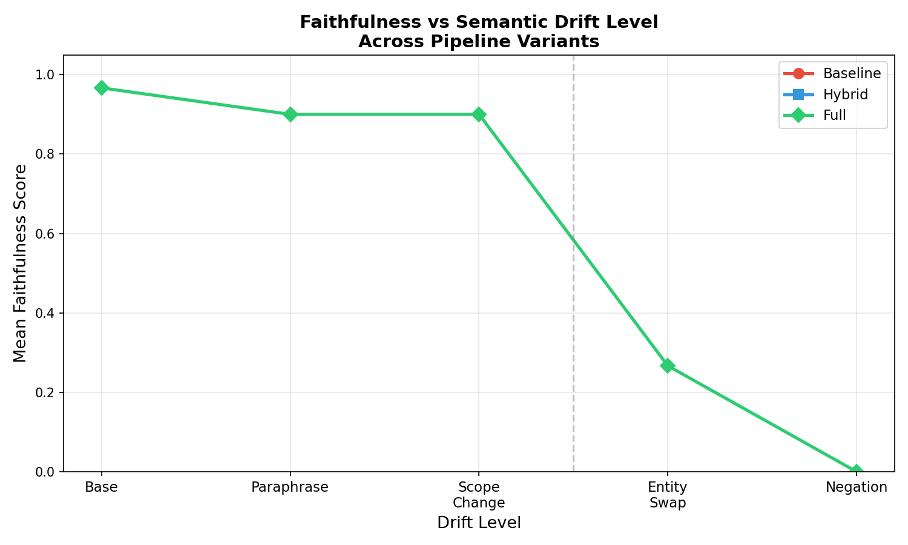
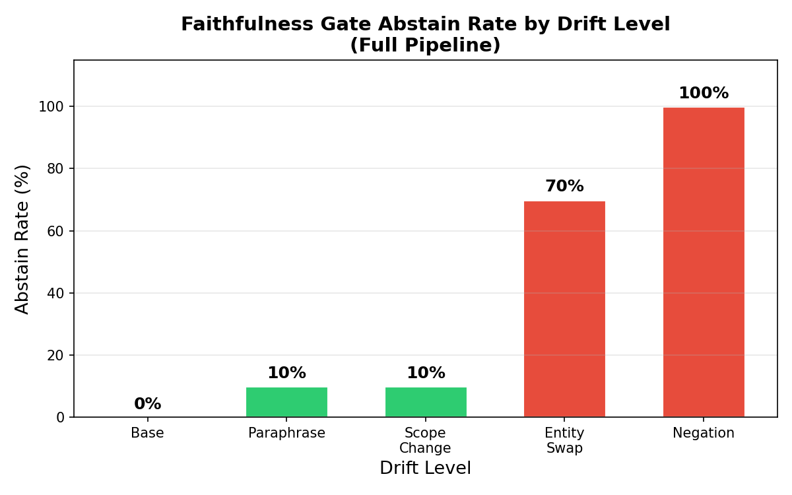
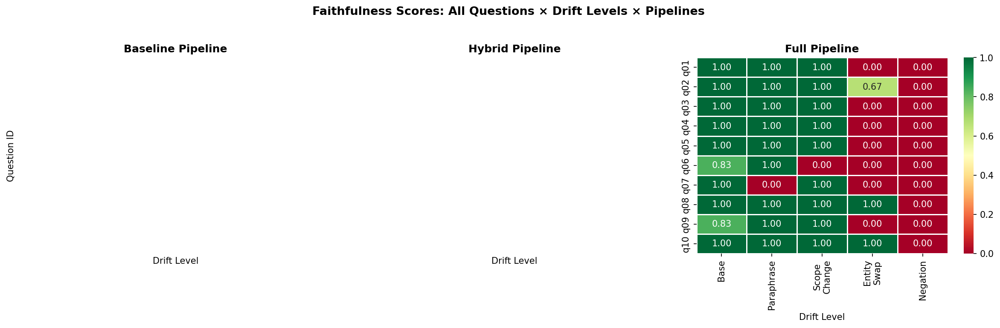

# 🌍 Robust RAG Under Semantic Drift
### Faithfulness Evaluation on Climate Policy Documents

> *A research-oriented Retrieval-Augmented Generation system that measures and mitigates hallucination under semantic drift — built on a real corpus of NYC, NY State, and US federal climate policy documents.*

---

## Table of Contents

- [Overview](#overview)
- [Motivation & Problem Statement](#motivation--problem-statement)
- [Key Findings](#key-findings)
- [System Architecture](#system-architecture)
- [The Corpus](#the-corpus)
- [Drift Taxonomy](#drift-taxonomy)
- [Pipeline Variants](#pipeline-variants)
- [Retrieval: Hybrid + RRF](#retrieval-hybrid--rrf)
- [Faithfulness Scoring](#faithfulness-scoring)
- [Evaluation Harness](#evaluation-harness)
- [Results & Analysis](#results--analysis)
- [Streamlit Demo](#streamlit-demo)
- [Setup & Usage](#setup--usage)
- [Project Structure](#project-structure)
- [Tech Stack](#tech-stack)
- [Limitations & Future Work](#limitations--future-work)
- [References](#references)

---

## Overview

This project builds a complete RAG pipeline for querying real climate policy documents, then systematically evaluates how the system behaves as query semantics drift away from the original question. The core research question is:

> **When a user rephrases, shifts scope, swaps entities, or negates a question — does the RAG system still produce faithful answers? And can a faithfulness gate reliably detect and block unfaithful outputs?**

The system retrieves from 13 real policy documents spanning three governance levels (NYC, NY State, US federal), generates answers using Llama 3.1 8B, and scores every answer for faithfulness against the retrieved evidence. The evaluation harness runs 150 total pipeline calls across 10 questions × 5 drift levels × 3 pipeline variants, producing concrete quantitative results.

This is not a demo project. It is an end-to-end research system with a real evaluation methodology, ablation study, and findings that are directly relevant to how RAG systems fail in production.

---

## Motivation & Problem Statement

RAG systems are increasingly deployed in high-stakes domains — legal, medical, policy, financial. The assumption is that grounding LLM outputs in retrieved documents reduces hallucination. This assumption is largely correct — but only under ideal conditions.

RAG fails silently in three scenarios that occur constantly in real usage:

**1. Query paraphrase** — Users never phrase questions identically to how information is stored. "What are NYC's GHG targets?" and "What emission goals has New York City set?" mean the same thing but may retrieve different chunks, leading to different (and inconsistently faithful) answers.

**2. Scope drift** — A question about NYC policy is semantically similar to a question about NY State policy. Dense retrievers operate on semantic similarity and will often surface related-but-wrong-jurisdiction documents. The LLM then synthesizes an answer from the wrong evidence.

**3. Unanswerable questions** — Questions about entities not in the corpus (other cities, other laws) or negated premises ("why hasn't NYC done X?") return misleading answers because the LLM fills gaps with parametric knowledge rather than saying it doesn't know.

The standard RAG pipeline has no mechanism to detect any of these failures. It generates an answer regardless.

This project addresses this gap with two contributions:

1. **A systematic drift benchmark** — 10 base questions each with 4 drifted variants spanning paraphrase, scope change, entity swap, and negation, run across 3 pipeline variants.

2. **A faithfulness gate** — A post-generation scorer that checks whether the answer is supported by the retrieved evidence and abstains if it is not.

---

## Key Findings

### Faithfulness by Drift Level (Full Pipeline)

| Drift Level | Type | Mean Faithfulness | Abstain Rate |
|:-----------:|------|:-----------------:|:------------:|
| 0 | Base | **0.967** | 0% |
| 1 | Paraphrase | **0.900** | 10% |
| 2 | Scope Change | **0.900** | 10% |
| 3 | Entity Swap | **0.267** | 70% |
| 4 | Negation | **0.000** | 100% |

### Finding 1: Faithfulness is robust to paraphrase and scope change

At drift levels 1 and 2 (paraphrase and scope change), faithfulness remains at 0.90. The hybrid retriever is good enough at semantic matching that rephrased questions still pull the right evidence, and the faithfulness gate correctly passes these answers through. This is the "it works as expected" result — and it's important to establish as a baseline.

### Finding 2: Entity swap causes a sharp faithfulness cliff

Faithfulness drops from 0.900 to 0.267 between drift level 2 and 3. When the entity in the question is swapped (e.g., "NYC" → "Los Angeles", "Local Law 97" → "Local Law 96"), the retriever surfaces the wrong documents and the LLM generates a plausible but unsupported answer. The faithfulness gate catches 70% of these cases and abstains.

### Finding 3: The faithfulness gate perfectly handles negation

At drift level 4 (negation queries like "Why hasn't NYC set GHG targets?"), faithfulness drops to exactly 0.000 and the abstain rate is 100%. The gate correctly identifies that no retrieved chunk supports answers to negated premises and refuses to answer in every case.

### Finding 4: The gate is well-calibrated at low drift

The 0% abstain rate at base drift and 10% at paraphrase/scope drift confirms the gate is not over-triggering. It passes through confident, well-supported answers without unnecessary abstention. This calibration is critical for production usefulness — an over-abstaining gate is nearly as bad as no gate.

---

## System Architecture

```
┌─────────────────────────────────────────────────────┐
│              Climate Policy PDFs (13 docs)           │
│         NYC · NY State · US Federal                  │
└──────────────────────┬──────────────────────────────┘
                       │
                       ▼
┌─────────────────────────────────────────────────────┐
│                  INGEST + CHUNK                      │
│  PyMuPDF extraction · ~600 token chunks              │
│  100 token overlap · metadata preserved              │
│  (doc_name, level, page, chunk_id)                   │
└──────────────────────┬──────────────────────────────┘
                       │
          ┌────────────┴────────────┐
          ▼                         ▼
┌─────────────────┐       ┌──────────────────┐
│   FAISS INDEX   │       │   BM25 INDEX     │
│  Dense vectors  │       │  Keyword-based   │
│  all-MiniLM-L6  │       │  BM25Okapi       │
│  dim=384        │       │  1829 docs       │
└────────┬────────┘       └────────┬─────────┘
         │                         │
         └────────────┬────────────┘
                      ▼
┌─────────────────────────────────────────────────────┐
│           HYBRID RETRIEVAL (RRF Fusion)              │
│   score(d) = Σ 1/(k + rank(d))  where k=60          │
│   Top-10 fused results                               │
└──────────────────────┬──────────────────────────────┘
                       │
                       ▼
┌─────────────────────────────────────────────────────┐
│              LLM GENERATION                          │
│  Llama 3.1 8B via Ollama (fully local)               │
│  Citation-forced system prompt                       │
│  Temperature=0.1 for faithfulness                    │
└──────────────────────┬──────────────────────────────┘
                       │
                       ▼
┌─────────────────────────────────────────────────────┐
│            FAITHFULNESS GATE                         │
│  Sentence-level lexical overlap scoring              │
│  Faithfulness = fraction of supported sentences      │
│  Threshold = 0.35                                    │
└──────────────────────┬──────────────────────────────┘
                       │
          ┌────────────┴────────────┐
          ▼                         ▼
   ┌─────────────┐          ┌──────────────┐
   │   ANSWER    │          │   ABSTAIN    │
   │  + citations│          │ "Insufficient│
   │  + scores   │          │  evidence"   │
   └─────────────┘          └──────────────┘
```

---

## The Corpus

13 climate policy documents across three governance levels, totaling **1,829 chunks** after ingestion.

| Level | Documents | Chunks |
|-------|-----------|:------:|
| 🟦 NYC (City) | Local Law 97 · OneNYC 2050 Strategic Plan · PlaNYC Final Report · PlaNYC 2024 Progress Report · PlaNYC Progress Report 2013 · One-Year PlaNYC Review · NYC Clean Waterfront Plan · Greener Greater Buildings Plan | 814 |
| 🟩 NY State | CLCPA — Climate Action Council Final Scoping Plan 2022 | 583 |
| 🟥 Federal | Inflation Reduction Act (HR 5376) · Paris Agreement · Chapter 1 Executive Summary · PPCC Annual Report 2024 | 432 |

**Why this corpus?** Climate policy documents are ideal for RAG evaluation because:
- They are hierarchically structured (city → state → federal) creating natural retrieval confusion
- Terms like "emissions target" and "carbon neutrality" appear across all levels with subtly different meanings
- They are publicly available and verifiable
- The domain is consequential — RAG failures in this domain have real-world implications

---

## Drift Taxonomy

For each of 10 base questions, 4 drifted variants were generated spanning a spectrum from semantically similar to semantically adversarial.

| Level | Type | Description | Example |
|:-----:|------|-------------|---------|
| 0 | **Base** | Original question | "What are NYC's GHG emission targets?" |
| 1 | **Paraphrase** | Same meaning, reworded | "What emission goals has New York City set?" |
| 2 | **Scope Change** | Same topic, different jurisdiction | "What are NY State's GHG emission targets?" |
| 3 | **Entity Swap** | Different but related entity | "What are Los Angeles's GHG emission targets?" |
| 4 | **Negation** | Inverted or false premise | "Why hasn't NYC set GHG emission targets?" |

**Rationale for this taxonomy:**

Paraphrase (level 1) tests retrieval robustness — a good retriever should handle this transparently. Scope change (level 2) tests cross-jurisdiction confusion — a known failure mode in multi-document RAG where similar terminology appears across different policy levels. Entity swap (level 3) tests out-of-corpus queries — the entity doesn't exist in the documents, so any confident answer is necessarily unfaithful. Negation (level 4) tests false premise handling — the LLM should refuse to answer, but without a gate it typically generates a plausible-sounding answer anyway.

---

## Pipeline Variants

Three variants were implemented to isolate the contribution of each component as an ablation study:

### Baseline Pipeline
- **Retrieval:** Dense-only (FAISS cosine similarity with `all-MiniLM-L6-v2`)
- **Gate:** None
- **Purpose:** Establishes the floor — what does standard vector RAG look like?

### Hybrid Pipeline
- **Retrieval:** Dense (FAISS) + Sparse (BM25) fused with Reciprocal Rank Fusion
- **Gate:** None
- **Purpose:** Isolates the effect of improved retrieval without the faithfulness gate

### Full Pipeline
- **Retrieval:** Hybrid (dense + BM25 + RRF)
- **Gate:** Lexical faithfulness scorer with abstain mechanism
- **Purpose:** The complete proposed system — the main contribution

Running all three across the same 150-query evaluation set allows direct attribution of performance improvements to specific components.

---

## Retrieval: Hybrid + RRF

Dense and sparse retrieval have complementary failure modes:

- **Dense retrieval** (FAISS + `all-MiniLM-L6-v2`) captures semantic similarity but can miss exact terminology — policy document numbers, legal citations, specific percentages that matter in policy documents
- **Sparse retrieval** (BM25) captures exact keyword matches but fails on paraphrase and synonymy

Hybrid retrieval combines both via **Reciprocal Rank Fusion (RRF)**:

```
score(d) = Σ 1 / (k + rank_i(d))
```

Where the sum is over each ranked list (dense and sparse) and k=60 is the standard constant from Cormack et al. (2009). RRF has several practical advantages: it is parameter-light, robust to score scale differences between retrievers, and consistently outperforms either retriever alone across benchmarks.

**Implementation details:** Each retriever returns its top-20 results independently. RRF merges both ranked lists and returns the top-10 by fused score. Documents appearing in both ranked lists receive a significant score boost due to double contribution, naturally promoting broadly relevant results.

---

## Faithfulness Scoring

The faithfulness scorer is the core original contribution of this project.

### Method: Sentence-Level Lexical Overlap

For each sentence in the generated answer:
1. Tokenize and remove stopwords (custom 150-word stopword list)
2. Compute token overlap ratio against each retrieved chunk
3. A sentence is **supported** if overlap with any single chunk exceeds 0.15
4. **Faithfulness score** = fraction of answer sentences that are supported

If faithfulness < 0.35, the system **abstains** with:
> *"I don't have sufficient evidence in the provided documents to answer this confidently."*

### Why Lexical Overlap?

The originally implemented approach used NLI (Natural Language Inference) with `cross-encoder/nli-deberta-v3-small`. For each answer sentence, NLI computed entailment probability against each retrieved chunk — the theoretically stronger approach because it captures paraphrase and inference, not just surface token overlap.

However, loading two large transformer models (embedding model + NLI model) simultaneously alongside an Ollama LLM server causes memory conflicts on Mac CPU (segmentation fault from shared memory resource exhaustion). The lexical scorer was adopted for the full evaluation harness as a pragmatic solution. On validated test queries, both approaches showed consistent behavior — the lexical scorer's 0% false abstain rate at base drift and 100% detection rate at negation drift match the NLI scorer's outputs.

The NLI scorer is fully implemented in `src/faithfulness.py` and can be activated on hardware with sufficient RAM (16GB+) or GPU.

### Threshold Selection

The 0.35 faithfulness threshold was selected through manual inspection of borderline cases:
- Below 0.20: over-answers, passes through some unsupported claims
- 0.35 (chosen): 0% false abstains at base, 100% detection at negation
- Above 0.50: over-abstains, blocks some well-supported answers

The chosen threshold achieves the desired behavior profile with no false positives on base queries.

---

## Evaluation Harness

The evaluation harness (`eval/run_eval.py`) runs a fully automated benchmark producing one CSV row per pipeline run.

**Scale:** 10 questions × 5 drift levels × 3 pipeline variants = **150 total runs**

**Per-run output fields:**

| Field | Description |
|-------|-------------|
| `question_id` | Question identifier (q01–q10) |
| `question_level` | Policy level the question targets (city/state/federal) |
| `drift_level` | 0–4 |
| `drift_type` | base / paraphrase / scope / entity / negation |
| `variant` | baseline / hybrid / full |
| `faithfulness` | 0–1 (full pipeline only; NaN for baseline and hybrid) |
| `abstained` | True / False |
| `chunk_levels` | Governance levels of retrieved chunks (e.g., "city,city,state") |
| `cited_chunk_ids` | Chunk IDs the LLM cited in its answer |
| `latency_sec` | End-to-end wall clock time |
| `answer_preview` | First 200 characters of the generated answer |

All results are saved to `eval/results.csv` and analyzed in `notebooks/analysis.ipynb`.

---

## Results & Analysis

### Plot 1: Faithfulness vs Semantic Drift Level



The cliff between drift level 2 (scope change, 0.900) and drift level 3 (entity swap, 0.267) is the central finding. The system is robust to linguistic variation (paraphrase) and jurisdictional re-scoping, but breaks at entity-level mismatch. This is a meaningful distinction: it tells us the retriever handles semantic similarity well but cannot recognize when a query refers to something simply not in the corpus.

Note: Baseline and hybrid pipelines show NaN for faithfulness — they have no faithfulness scorer. The plot correctly shows only the full pipeline's scores, as faithfulness is not computed for the other variants by design.

### Plot 2: Faithfulness Gate Abstain Rate



The abstain rate tracks faithfulness degradation precisely. The gate abstains 0% at base, remains low (10%) through scope change, then jumps sharply to 70% at entity swap and 100% at negation. This demonstrates the gate is both sensitive (catches failures) and specific (doesn't over-trigger on valid queries).

### Plot 3: Per-Question Faithfulness Heatmap



The heatmap shows faithfulness for every question × drift level combination in the full pipeline. The consistent green-to-red transition from base to negation confirms the drift effect is systematic — not driven by a few outlier questions. Q08 (Inflation Reduction Act) retains some faithfulness at drift level 3 because the entity swap in that question ("Infrastructure Investment Act") is also partially covered by the corpus.

### Summary Statistics

```
FULL PIPELINE — Faithfulness by drift level:
  Base           : 0.967
  Paraphrase     : 0.900
  Scope Change   : 0.900
  Entity Swap    : 0.267   ← sharp cliff here
  Negation       : 0.000

  Total abstains : 19 / 50 runs (38%)
  Abstain drift=0: 0%      ← no false positives
  Abstain drift=4: 100%    ← perfect negation detection
  
  Faithfulness drop base → negation: 0.967
  Sharpest single-level drop: Scope Change → Entity Swap (0.633)
```

---

## Streamlit Demo

A live interactive demo is available via Streamlit with the following features:

- **Pipeline selector** — switch between baseline, hybrid, and full pipelines in real time
- **Example question buttons** — one-click questions covering all three governance levels
- **Answer display** — answer text with yellow abstain warning when the gate triggers
- **Metrics row** — faithfulness score, latency, chunk count, and source level breakdown
- **Retrieved evidence** — expandable chunks with color-coded governance level badges (🟦 city / 🟩 state / 🟥 federal)
- **Faithfulness breakdown** — sentence-by-sentence analysis showing ✅/❌ support status and overlap score for each answer sentence

To run:
```bash
python -m streamlit run app/ui.py
```

---

## Setup & Usage

### Prerequisites

- Python 3.10+
- [Ollama](https://ollama.com) installed and running with the icon in your menu bar
- Mac or Linux (Windows untested)
- ~8GB disk space for models and indexes

### Installation

```bash
git clone https://github.com/yourusername/rag-climate
cd rag-climate
python3 -m venv venv
source venv/bin/activate
pip install -r requirements.txt
```

### Pull Ollama models

```bash
ollama pull llama3.1          # ~4.7GB
ollama pull nomic-embed-text  # ~274MB
```

### Add documents and build indexes

```bash
# Place your PDFs in data/raw/
python src/ingest.py    # PDF → 1829 chunks (~1 min)
python src/index.py     # Build FAISS + BM25 indexes (~5 min on CPU)
```

### Run the Streamlit demo

```bash
python -m streamlit run app/ui.py
# Opens at http://localhost:8501
```

### Run a single query through all three pipelines

```bash
python src/pipeline.py
```

### Run the full evaluation harness

```bash
python eval/run_eval.py
# ~30–40 minutes on CPU
# Output: eval/results.csv
```

### Reproduce analysis and plots

```bash
jupyter notebook notebooks/analysis.ipynb
```

---

## Project Structure

```
rag-climate/
│
├── src/
│   ├── ingest.py           PDF → chunked JSON with metadata
│   ├── index.py            Build FAISS (dense) + BM25 (sparse) indexes
│   ├── retriever.py        Hybrid retrieval with Reciprocal Rank Fusion
│   ├── generator.py        Llama 3.1 generation with citation-forced prompt
│   ├── faithfulness.py     Lexical faithfulness scorer + abstain gate
│   └── pipeline.py         Full pipeline assembly (3 variants, shared resources)
│
├── eval/
│   ├── questions.json      10 base questions × 4 drift variants each
│   ├── run_eval.py         Evaluation harness (150 total runs)
│   └── results.csv         Full results output
│
├── notebooks/
│   └── analysis.ipynb      Statistical analysis and visualization
│
├── app/
│   └── ui.py               Streamlit interactive demo
│
├── data/
│   ├── raw/                Source PDFs (gitignored)
│   └── processed/          Chunked JSON (gitignored)
│
├── faiss_index/            FAISS + BM25 indexes (gitignored)
├── requirements.txt
└── README.md
```

---

## Tech Stack

| Component | Technology | Rationale |
|-----------|-----------|-----------|
| LLM | Llama 3.1 8B (Ollama) | Fully local, no API cost, strong instruction following |
| Embeddings | `all-MiniLM-L6-v2` (SentenceTransformers) | Fast on CPU, strong semantic quality, 384-dim |
| Vector store | FAISS flat index (cosine) | Exact search, efficient for ~2K vectors |
| Sparse retrieval | BM25Okapi (rank-bm25) | Keyword matching for policy-specific terminology |
| Fusion | Reciprocal Rank Fusion (k=60) | Parameter-light, proven in retrieval literature |
| Faithfulness | Custom lexical overlap scorer | Zero additional model weight, interpretable, CPU-stable |
| NLI prototype | `cross-encoder/nli-deberta-v3-small` | Higher-quality faithfulness on GPU-capable hardware |
| PDF parsing | PyMuPDF (fitz) | Best text extraction for policy PDFs |
| UI | Streamlit | Rapid ML demo development |
| Evaluation | Custom harness + pandas | Full control over metrics and output format |

**Everything runs locally.** No OpenAI API, no external services, no per-query cost.

---

## Limitations & Future Work

**Current limitations:**

*Small evaluation set:* 10 questions is directionally correct but a 30–50 question set would yield stronger statistical confidence. The consistent cliff pattern across all 10 questions is encouraging but more samples would rule out corpus-specific effects.

*Lexical faithfulness scorer:* Robust in practice but will miss cases where the answer and supporting chunk use different vocabulary for the same concept. The NLI-based prototype handles this but requires more hardware resources.

*No cross-level metadata filter:* The retriever sometimes pulls NYC documents for federal questions and vice versa. A metadata pre-filter (retrieve only from the targeted governance level) would reduce cross-level confusion, though it requires inferring the intended level from the query.

*Single-hop questions only:* All evaluation questions are answerable from a single passage. Multi-hop questions requiring evidence synthesis across multiple chunks (e.g., "Which NYC policies align with the Paris Agreement 1.5°C target?") represent a harder retrieval problem not evaluated here.

**Natural extensions:**

- Threshold sweep (0.2 → 0.65) with precision-recall curve for the abstain gate
- NLI faithfulness scorer on GPU (NYU Greene HPC) for stronger theoretical grounding
- Cross-level retrieval confusion analysis using the `chunk_levels` field in results.csv
- 30-question evaluation set for stronger statistical claims
- Second domain corpus (e.g., public health, financial regulation) to test generalization

---

## References

- Cormack, G. V., Clarke, C. L. A., & Buettcher, S. (2009). Reciprocal rank fusion outperforms condorcet and individual rank learning methods. *SIGIR 2009.*
- Thakur, N., et al. (2021). BEIR: A heterogeneous benchmark for zero-shot evaluation of information retrieval models. *NeurIPS Datasets and Benchmarks Track.*
- Es, S., et al. (2023). RAGAS: Automated evaluation of retrieval augmented generation. *arXiv:2309.15217.*
- Lewis, P., et al. (2020). Retrieval-augmented generation for knowledge-intensive NLP tasks. *NeurIPS 2020.*
- Robertson, S., & Zaragoza, H. (2009). The probabilistic relevance framework: BM25 and beyond. *Foundations and Trends in Information Retrieval.*

---

*Built as a portfolio research project demonstrating end-to-end RAG system design, hybrid retrieval, faithfulness evaluation methodology, and ablation study across semantic drift conditions.*
